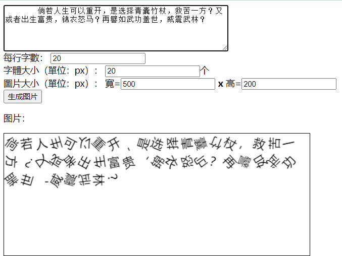
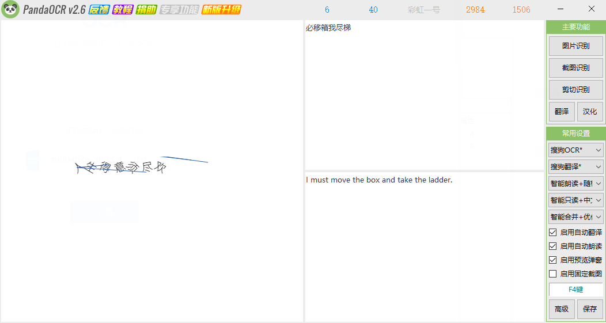

# ocr-bye
Stay away from OCR , convert your words into image which can not be recognized easily. 
 
再见，OCR！远离OCR，将文字转换成OCR无法轻易识别的图片。

## Features
- 文字单独随机旋转角度
- 干扰线
- 文字设置大小
- 生成图片自适应大小
- 每行字数设置
- 添加橫格綫
- todo：文字随机大小
- todo：干扰线粗细随机
- todo：火星文替换
- todo：文字拉升变形

## Online Demo
[Demo Page](https://blog.lebear.top/ocr-bye/)

## Get Start
Put this project in anywhere you can visit, then open `index.html` with your browser.

## Snapshot
Example：

Recognized Result by PandaOCR:

## Updates

### 23/04/08
- 添加github action，自动部署demo

### 23/04/08
- 美化頁面結構（by chatGPT）
- 添加橫格綫，讓生成的圖片更加整齊