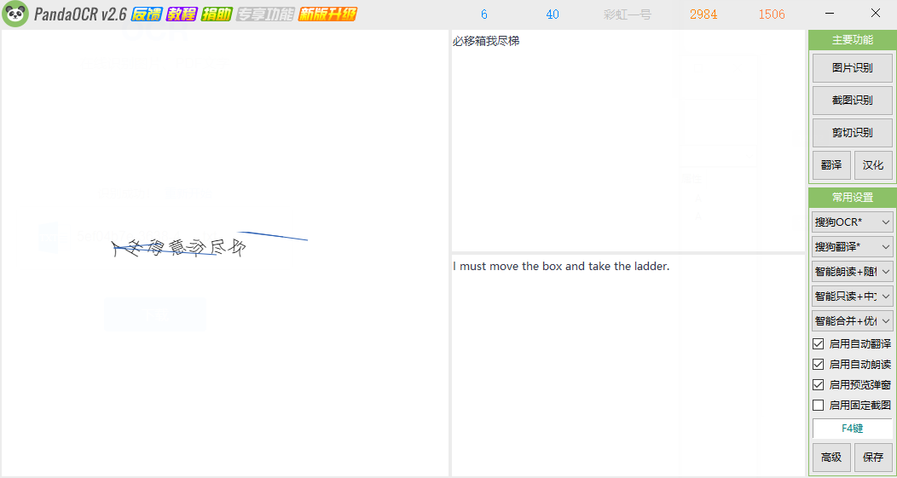

# ocr-bye
Stay away from OCR , convert your words into image which can not be recognized easily. 
 
再见，OCR！远离OCR，将文字转换成OCR无法轻易识别的图片。

## Features
- 文字单独随机旋转角度
- 干扰线（左中右分区更均衡）
- 文字设置大小
- 生成图片自适应大小（导出时自动裁剪透明空白边）
- 每行字数设置
- 添加橫格綫
- 文字随机大小
- 干扰线粗细随机
- 火星文替换
- 文字拉升变形
- 本地自动记忆上次配置（localStorage）

## Configuration
- 行列控制：`每行字数`、`字体大小`、`旋转角度范围`
- 干扰控制：`干扰线数量`、`干扰线粗细随机`、`横格线`
- 变形控制：`文字随机大小`、`文字拉升变形`
- 文本处理：`火星文替换`

## Notes
- 建议将干扰线数量设为 6 及以上，左中右覆盖更均衡。
- 配置会自动保存在浏览器本地存储中，下次打开页面会自动恢复。

## Online Demo
[Demo Page](https://blog.lebear.top/ocr-bye/)

## Get Start
Put this project in anywhere you can visit, then open `index.html` with your browser.

## Snapshot
Example：

Recognized Result by PandaOCR:

## Updates

### 26/04/07
- 修复干扰线分布偏右问题，增强左中右区域覆盖
- 新增随机字号、随机线宽、火星文替换、文字拉升变形
- 优化页面布局与参数面板展示
- 修复导出图片右侧空白问题（透明边自动裁剪）
- 支持记忆上次使用配置（localStorage）

### 23/04/12
- 添加一键复制图片功能

### 23/04/08
- 添加github action，自动部署demo

### 23/04/08
- 美化頁面結構（by chatGPT）
- 添加橫格綫，讓生成的圖片更加整齊